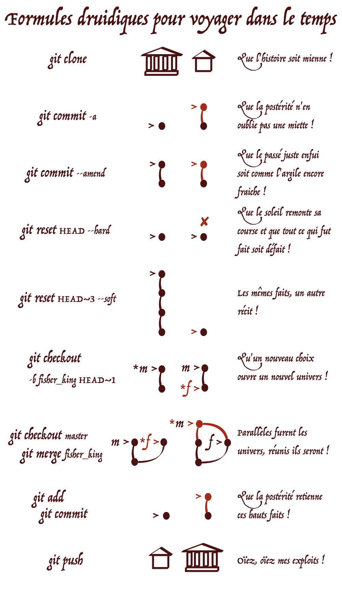
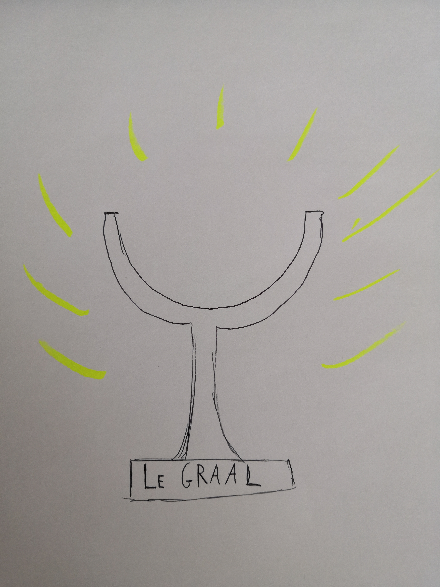

# LÀ GÎT LE GRAAL
# L'introduction à GIT dont vous êtes le héros
Aurélien Bénel, 2018 (révision en 2020)

## Prologue

Jeune damoiselle, jeune damoiseau, si vous lisez ce texte c'est que vous avez été jugé•e digne par le Roi Arthur de devenir chevalier de la Table Ronde.

Une fois adoubé•e, vous devez chercher, autour de la Table Ronde, une chaise restée libre et **graver votre nom** (`Sign in`). [🧙🏼‍♀️Besoin d'aide ?](./fig/sign-in.png)

Le parchemin que vous avez entre les mains est de la main d'Arthur. Pour laisser toutes leurs chances à vos frères et sœurs d'armes, vous devrez en **faire une copie** (`Fork`) avant de rendre l'original. [🧙🏼‍♀️](./fig/fork.mp4)

Avant de partir à l'aventure, vous harnachez votre cheval et **rassemblez votre équipement** :

- de quoi écrire votre histoire (installez [Atom](https://atom.io) et [Git](https://git-scm.com/downloads)),
- de quoi l'illustrer (crayon, papier et appareil photo ou scanner).

## Aux portes de Camelot

Vous enfourchez votre fier destrier, sortez des écuries au pas, traversez ce que l'on appelle "la basse cour"... À l'instant où vous vous apprêtez à franchir le pont-levis, un vieillard, vêtu d'un long manteau blanc et appuyé sur un bâton noueux, vous tend un bout d'étoffe sur lequel est inscrit :

Votre regard, plein d'étonnement, quitte le bout d'étoffe pour chercher les yeux du vieillard. Mais celui-ci a disparu.

Il est temps de prendre des notes de ce qui s'est passé :

1. Faites vous une copie locale. [🧙🏼‍♀️](./fig/clone.mp4)
2. Éditez le fichier `etat.yml` avec Atom:
  - changez le lieu en `pont-levis`,
  - ajoutez `grimoire` à votre inventaire. [🧙🏼‍♀️](./fig/grimoire.mp4)
3. Faites en une nouvelle entrée dans votre journal. [🧙🏼‍♀️](./fig/commit.mp4)

Non, sérieusement ?!?
Vous croyez qu'on parlera encore de vous dans 15 siècles si vous vous y prenez comme ça ?
Sachez qu'il n'y a de bon héros sans un bon ménestrel pour chanter ses exploits.
Et que pourra faire un ménestrel de votre histoire si vous ne vous appliquez pas un peu ?

Amendez l'entrée de votre journal de manière à ce que le message :

- commence par un préfixe correspondant au bénéfice de votre exploit (`ADVERSAIRE:`, `ÉQUIPEMENT:`, `TÉMOIGNAGE:`, etc.),
- soit correct grammaticalement,
- soit aussi explicite que possible (tout en restant court). [🧙🏼‍♀️](./fig/amend.mp4)

C'est quand même mieux !
Là vous pouvez commencer à être fier de vos exploits.

## Le chevalier noir

Sur la route, les champs laissent la place aux arbres, les villages aux forêts.
Votre monture continue d'un pas régulier, vous vous assoupissez.

Vous êtes réveillé brusquement par une grande douleur au flanc, une sensation de chute et le bruit de votre armure sur le sol.
Au-dessus de vous un chevalier en armure noire, vous regarde en ricanant.
Le chevalier attache la bride de votre cheval à sa selle et poursuit sa route, vous laissant, couvert de boue (et de honte), dans l'ornière.

Modifiez le document `etat.yml` (mais sans mettre à jour votre journal):

- changez le lieu en `route`,
- supprimez `cheval` de votre inventaire,
- retranchez un point à votre `santé`. [🧙🏼‍♀️](./fig/honte.mp4)

Vous continuez en boitant sur la route... en maudissant le chevalier noir et vous-même. Si seulement, vous ne vous étiez pas endormi !
À vrai dire, peut-être qu'il y a une formule pour que tout ceci ne soit jamais arrivé...

Allez-y, n'ayez pas peur... Qu'est-ce qui peut bien arriver de mal en réécrivant le passé ? [🧙🏼‍♀️](./fig/reset-hard.mp4)

Et voilà ! À nouveau, vous trottez fièrement sur les routes de Bretagne.
La route se sépare en deux :

- à gauche, une borne milliaire romaine indique "Fontaine merveilleuse" (vous avez bien fait d'apprendre le latin !),
- à droite "Roi pêcheur" est gravé sur une pancarte de bois.

Plus attirés par les "merveilles" que par la "pêche", vous et votre cheval vous engagez sur la route de gauche.

## La fontaine merveilleuse

Un bruissement cristallin vous guide vers une petite clairière.
De l'eau coule de la roche dans une petite cavité avant de disparaître à travers la forêt.
Vous vous désaltérez ainsi que votre cheval et une petite quantité d'eau se répand sur la margelle.
À ce moment précis, d'épais nuages viennent obscurcir le ciel et une terrible averse se met à tomber.

Vous tentez de vous mettre à couvert, et là, à l'orée de la forêt, vous reconnaissez la sinistre silhouette du chevalier noir.
Cette fois-ci, il ne vous aura pas par surprise !
Vous dégainez votre arme et chargez votre ennemi avec un cri guerrier.

Votre charge lui inflige une sérieuse blessure, mais il contre-attaque profitant de l'ouverture.
Prenez note de cette première attaque :

- indiquez `fontaine` comme lieu,
- retranchez 6 points de santé au chevalier noir,
- 3 à vous-même,
- ajoutez une entrée à votre journal. [🧙🏼‍♀️](./fig/chevalier1.mp4)

Faisant de grands moulinets avec son épée, démesurément longue, il parvient à vous faire une grande estafilade au visage :

- retranchez 2 points à votre santé,
- ajoutez une entrée à votre journal. [🧙🏼‍♀️](./fig/chevalier2.mp4)

Avec le courage du désespoir vous bondissez vers lui et profitant de la lourdeur de son épée, vous tournez autour de lui, enfoncez votre épée entre deux plaques de son armure, d'un côté puis de l'autre. Il tombe à terre. Alors que vous ramassez sa très longue épée, dans un dernier sursaut, il vous étrangle de ses mains.
Prenez note de cette dernière attaque :

- retranchez tous les points de santé du chevalier noir,
- retranchez en 4 à vous-même,
- ajoutez l'`épée longue` à votre inventaire,
- ajoutez une entrée à votre journal. [🧙🏼‍♀️](./fig/chevalier3.mp4)

Vous avez gagné mais à quel prix !
Toujours soucieux de l'image que l'on aura de vous dans quinze siècles, vous décidez de résumer un peu :

- dans votre journal, effacez les trois dernières entrées (sans rien changer à ce qui s'est passé),
- créez une nouvelle entrée pour l'ensemble du combat. [🧙🏼‍♀️](./fig/reset-soft.mp4)

Avec votre nouvelle épée à la main, vous êtes fier comme Artaban. Tout irait pour le mieux, si vous ne gisiez pas dans votre sang. Et d'ailleurs, aviez-vous réellement besoin de cette épée ?

Vous décidez d'explorer une autre réalité dans laquelle vous auriez choisi de suivre la route du Roi Pêcheur, où vous n'auriez pas votre épée et ne seriez pas en train d'agoniser...

Allez-y ! [🧙🏼‍♀️](./fig/checkout.mp4)

Ouvrez le document `etat.yml` et vérifiez que tout est redevenu comme avant.

## Le lion et le serpent

Sur le chemin du Roi Pêcheur, vous découvrez un curieux spectacle : un féroce combat entre un lion est un serpent.
Ce serpent n'est pas ordinaire, il crache du feu !
Vous songez un instant à les éviter et à continuer votre chemin.
Puis, vous disant en vous-même qu'il s'agit sans doute d'une nouvelle quête permettant de prouver votre valeur et votre bravoure, vous choisissez le parti du lion et attaquez avec lui le serpent.

Le combat est rude, mais à la fin, le serpent s'effondre sur le sol, inanimé.
L'espace d'un instant, vous êtes inquiet de l'intérêt que le lion vous manifeste.
Mais vous découvrez qu'il lèche vos blessures.

Prenez note de ce qui vous arrive :

- retranchez 20 points au serpent,
- 8 au lion,
- 2 à vous,
- ajoutez `lion` à votre inventaire,
- ajoutez une nouvelle entrée à votre journal. [🧙🏼‍♀️](./fig/lion.mp4)

## Harpin de la montagne

Vous traversez un village.
Vous faites forte impression avec votre armure, votre cheval et votre nouvel animal de compagnie.

Reconnaissant l'écu de la Table Ronde, des villageois s'adressent à vous : "Oh, noble chevalier, aidez nous, par pitié !".
Vous vous approchez et écoutez leur récit : "Harpin, le géant de la montagne, vole notre bétail, détruit nos maisons. Jour après jour, croissent son arrogance, le nombre de ses crimes et notre malheur".

N'écoutant que votre courage, vous faites un détour par la montagne.
Le terrible Harpin, victime de son arrogance, ne porte pas d'armure.
Il ne faut que peu de temps avant qu'il ne soit occis par les crocs de votre lion et le tranchant de votre lame.

Prenez note de ce qui vous arrive :

- indiquez que vous êtes sur la `montagne`,
- retranchez 25 points de santé au géant,
- 1 à votre lion,
- 1 à vous-même. [🧙🏼‍♀️](./fig/montagne.mp4)

## Le pont de l'épée

Redescendant de la montagne, vous voyez devant vous le château du Roi Pêcheur.
Vous aimeriez y pénétrer. Hélas, un torrent impétueux aux eaux noires comme la mort, vous barre le passage.

Les rives ne sont pas très éloignées. Si seulement vous aviez un objet assez long et assez solide pour vous servir de pont...

Un souvenir un peu flou vous parvient... Comme si dans une autre réalité, vous aviez remporté au prix d'un fier combat, une épée formidablement longue et solide...

Faites se rejoindre les deux réalités.

Un halo rouge vous alerte sur le paradoxe temporel qui est en cours :

- vous ne pouvez pas être à la fois mourant et plein de vie (Schrödinger et son chat n'existent pas encore),
- vous ne pouvez pas être à la fois ici et là-bas.

Entre les deux états de santé, choisissez le meilleur (vous n'avez pas vraiment envie, jusqu'à la fin de l'histoire, de ramper en vous vidant de votre sang) et dites que vous êtes sur le `pont de l'épée`.
Faites de cette fusion de deux univers, une nouvelle entrée à votre journal. [🧙🏼‍♀️](./fig/merge.mp4)

Traversez le pont de l'épée et pénétrez dans le château.

## Le roi pêcheur

Vous êtes accueilli avec beaucoup de bienveillance par le Roi Pêcheur. Celui-ci est couché et blessé à la jambe. Une lance ensanglantée est posée à ses côtés.

Un étrange rituel est à l'œuvre :
des serviteurs ouvrent la marche avec des chandeliers,
d'autres suivent avec des plats de grand prix,
et enfin, au dernier rang, une jeune servante porte un "graal" étincelant.
Une lumière presque irréelle semble émaner de l'objet.

Vous vous demandez si le rituel est en lien avec la blessure du roi, si le Graal aurait le pouvoir de guérir sa blessure et sa malédiction.
Mais vous n'osez pas.

La lumière baisse et vos paupières se ferment. Vous vous endormez.

Au petit matin, vous vous réveillez dans la forêt. Le château, le Roi Pêcheur, sa cour, le Graal ont disparu.

Il est temps que vous preniez note de ce qui vous est arrivé.
Le Graal, personne ne l'a jamais vu, ni ne sait ce que c'est : une coupe, une fiole de sang, des rouleaux de parchemin, un antique chaudron celte ?
Qui le sait, si ce n'est vous.

- Dessinez ce que vous avez vu.
- Numérisez-le et déposez le fichier dans ce dossier.
- Mettez le nom de votre image dans la référence ci-dessus de sorte qu'elle s'affiche.
- Ajoutez les deux fichiers (celui qui a été modifié et celui qui est nouveau) à une nouvelle entrée de votre journal.
- Quand vous êtes satisfait de la légende qui raconte vos hauts faits, publiez la. [🧙🏼‍♀️](./fig/push.mp4)
- Demandez leur avis à vos frères et sœurs d'arme (`pull request`) [🧙🏼‍♀️](./fig/pull-request.mp4) et en retour donnez votre avis sur leur propre légende.

---

## Sources

L'analogie entre Git et un jeu vidéo est reprise de l'incontournable [Git Magic](http://www-cs-students.stanford.edu/~blynn/gitmagic/intl/fr/), celle entre Git et une aventure textuelle de la prometteuse mais inachevée [Git-Adventure](https://github.com/schwern/git-adventure).

Les scènes de ce tutoriel sont librement inspirées des romans arthuriens de
Chrétien de Troyes (XIIe s.) :
[*Yvain ou le chevalier au lion*](https://fr.wikipedia.org/wiki/Yvain_ou_le_Chevalier_au_lion),
[*Lancelot ou le chevalier de la charrette*](https://fr.wikipedia.org/wiki/Lancelot_ou_le_Chevalier_de_la_charrette), [*Perceval ou le conte du Graal*](https://fr.wikipedia.org/wiki/Perceval_ou_le_Conte_du_Graal).

Certaines images référencées peuvent être protégées par le droit d'auteur.
